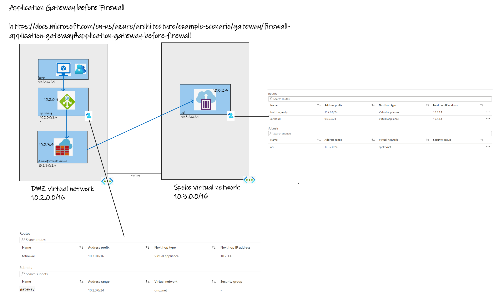
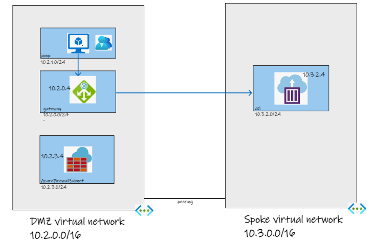

# Application Gateway before Firewall - a worked example
There are some circumastances where a workload needs to be protected by both a Web Application Firewall (WAF) and an Azure Firewall. One of the patterns for this is refered to as *application gateweay before firewall* https://docs.microsoft.com/en-us/azure/architecture/example-scenario/gateway/firewall-application-gateway#application-gateway-before-firewall - to quote the documentation:

In this option, inbound web traffic goes through both Azure Firewall and WAF. The WAF provides protection at the web application layer. Azure Firewall acts as a central logging and control point, and it inspects traffic between the Application Gateway and the backend servers. The Application Gateway and Azure Firewall aren't sitting in parallel, but one after the other.


The rest of this is a worked example of this pattern so you can see what needs to be configured and why.

## The Example Environment



In this sample, we are considering private users needing to access some form of web service on a spoke VNet. This can be any web service hosted in a VM, App Service, Kubernetes etc. But in the case of this exmample, it is a simple Azure Container Instances (ACI) sample app that is hosted in the *aci* subnet of the *spokevnet* VNet. The application gateway is to be configured as listening only on its private IP address and so to test this, there is a Linux VM which is in the same VNet as the application gateway - but a different subnet. The VNets are peered so that requests from the *dmzvnet* VNet can get routed to the ACI-hosted web app in the *spokevnet*.

Without any firewall or network routing configured, the environment looks like this:



So, in the test VM
```
curl 10.2.0.4
```
will result in a repsonse from the test app because we have configured application to use the ACI web application as its backend and we are sending the request to the private IP address of the application gateway (10.2.0.4)
