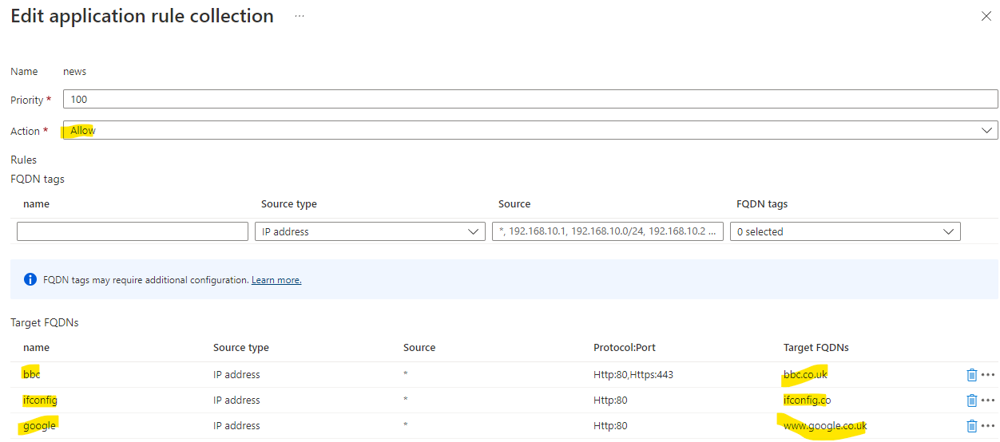

# Application Gateway before Firewall - a worked example
There are some circumastances where a workload needs to be protected by both a Web Application Firewall (WAF) and an Azure Firewall. One of the patterns for this is refered to as [application gateweay before firewall](https://docs.microsoft.com/en-us/azure/architecture/example-scenario/gateway/firewall-application-gateway#application-gateway-before-firewall) - to quote the documentation:

> In this option, inbound web traffic goes through both Azure Firewall and WAF. The WAF provides protection at the web application layer. Azure Firewall acts as a central logging and control point, and it inspects traffic between the Application Gateway and the backend servers. The Application Gateway and Azure Firewall aren't sitting in parallel, but one after the other.

> 

The rest of this is a worked example of this pattern so you can see what needs to be configured and why.

## The Example Environment


In this sample, we are considering private users needing to access some form of web service on a spoke VNet. This can be any web service hosted in a VM, App Service, Kubernetes etc. But in the case of this exmample, it is a simple Azure Container Instances (ACI) sample app that is hosted in the *aci* subnet of the *spokevnet* VNet. The application gateway is to be configured as listening only on its private IP address and so to test this, there is a Linux VM which is in the same VNet as the application gateway - but a different subnet. The VNets are peered so that requests from the *dmzvnet* VNet can get routed to the ACI-hosted web app in the *spokevnet*.

Without any firewall or network routing configured, the environment looks like this:


So, in the test VM
```
curl 10.2.0.4
```
will result in a repsonse from the test app because we have configured application to use the ACI web application as its backend and we are sending the request to the private IP address of the application gateway (10.2.0.4)

## Building the sample - basic environment
The best approach is to build this in stages, verifying that the jump box VM can access the ACI-hosted web application before configuring the routing and the firewall.

### Virtual networks
1. Create the *dmzvnet* - you can use any addresses, but easiest to follow this sample 10.2.0.0/16
2. Add a subnet *gateway* 10.2.0.0/24
3. Add a subnet *AzureFirewallSubnet* 10.2.3.0/24 (the name of this subnet matters)
4. Add a subnet *jump* 10.2.1.0/24 to host the jumpbox
5. Create the *spokevnet* - you can use any addresses, but easiest to follow this sample 10.3.0.0/16
6. Add a subnet *aci* 10.3.2.0/24
7. choosing the dmzvnet, peer this to the spokesubnet

You should now have a pair of VNets with the subnets needed for later. The peering will allow requests from the dmzvnet to go to the spokevnet.
 
### Target ACI-hosted web app
This is a target web app to call. There are any number of ways of doing this, but the fastest is to use Azure Container Instances:
1. Create and AzureContainerInstance
2. Make sue you choose *private* for this
3. Choose a sample web app as its container - aci-helloworld:latest is fine
4. Set its network to be spokevnet and the subnet *aci*

This should result in a web app that is only visible in VNets and will have a private IP address from the range in the aci subnet, for example 10.3.2.4. We can't do much with this, so we need something inside a VNet to call this - hence the next step of provisioning a VM.

Your result ACI overview should look like this:

Note its private IP address (highlighted).


### Jump box to test private App Gateway endpoint
The only purpose of this jumpbox VM is to allow us to create requests into the environment that are sourced from some IP within the dmzvnet - this is essentially proxying for some form of internally-facing customer system that needs to access the API. As it's a VM, we can use command-line tools to poke around the environment.

Depending on your security stance, this VM can have a public IP address or be used via Azure Bastion.

To provision:
1. Create a Virtual Machine
2. Choose your favourite distro - I used Ubuntu 20.03
3. For bastion, do not create a public IP address
4. For budget concious, choose a burst VM size
5. In networking, attach this to the dmzvnet using the *jump* subnet

Once this has provisioned, open a shell into the VM:

```
curl 10.3.2.4
```
Should result in the HTML of the container app. If this does not work, check the IP address of your container.
```
<html>
<head>
  <title>Welcome to Azure Container Instances!</title>
</head>
<style>
h1 {
    color: darkblue;
    font-family:arial, sans-serif;
    font-weight: lighter;
} 
</style>

<body>

<div align="center">
<h1>Welcome to Azure Container Instances!</h1>

....

```

### Application gateway configuration
So, no we are going to introduce the application gateway. This needs to be the v2 SKU and you can either choose *Standard V2*  or *WAF V2* . As we are not going to edit WAF rules, the *Standard v2*  SKU should work.

1. Create an application gateway
2. Choose Standard V2 as the tier
3. Associate it with your *dmzvnet* with the *gateway* subnet
4. In frontends choose *both* for Frontend IP address type
5. Create a new public IP address (we won't use this, but it is required)
6. For private IP addresses, you need to set *Yes* for Use specific IP address and then if you have used the same addresses as this sample, then put in 10.2.0.4 (but this needs to be in the address range of your *gateway* subnet)
7. In backends, you need to "Add a backend pool", with a target IP address of your ACI-hosted web app. In my sample it is 10.3.2.4
8. In configuration, you need to add a routing rule, this has several steps where you need to add a listener and a backend target


Finally there is a configuration summary, which should look something like this:


9. Then go past tags, and review and create and finally press *Create*. This step will take some minutes


### Testing application gateway configuration
The testing is exaclty like the previous testing of the ACI-hosted web application, except that in the jumpbox VM we will use the private IP address of the application gateway.

```
curl 10.2.0.4
```
Should result in the HTML of the container app. If this does not work, check the IP address of your container.
```
<html>
<head>
  <title>Welcome to Azure Container Instances!</title>
</head>
<style>
h1 {
    color: darkblue;
    font-family:arial, sans-serif;
    font-weight: lighter;
} 
</style>

<body>

<div align="center">
<h1>Welcome to Azure Container Instances!</h1>

....

```

If this does not work, the some troubleshooting of the application gateway is necessary. The best place to start is the *Backend Health" section of the applciation gateway:


If, like the above, you see an error, this needs to be addressed. Check the backend settings again - the port and then the IP address in the backend pool.

Once the configuration is correct, you should see good backend health


**Only once you are sure that the application gateway works and that you can access the ACI-hosted web application from the application gateway's private IP address move to the next step.**

## Sample with the full application gateway before firewall pattern

In this section, we are going to provision an Azure firewall and route requests to this from the application gateway.

### Create an Azure Firewall
1. In your *dmzvnet* check that you have a subnet *AzureFirewallSubnet* - create this if not already there.
2. Create the fireall in the same region as everything else, name it, choose the standard tier and "Use Firewall rules (classic) to manage this firewall* (this just makes it easier to administer firewall rules), then choose your dmzvnet which will only work if there is the AzureFirewallSubnet and then create a new public IP address for the firewall. The configuration should look like below:


It will take some time for the firewall to provision.

### Configure Firewall
Once the firewall has been provisioned, there are 2 things that should be done:
1. Enable diagnostics so that we can see the logs generated
2. Enable some target addresses. By default, the firewall will block, so for it to allow traffic to our ACI-hosted web app, we must whitelist it's address

#### Enable diagnostics
1. Go to the firewall and choose the *Diagnostic Settings* menu


2. Choose *Add diagnostic settings*, choose all of the logs and then point this to a log analytics workspace in the same region as the firewall (there is usually one) and then hit *Save*


The logs, when generated should now be visible in the *Logs* menu of the firewall **BUT** as we are not yet directing traffic to the firewall, then there will not be any logs for now.

#### Whitelist target addresses
By default, the firewall (once we set it up to accept requests - in the following steps) will block requests. So we need to whitelist the ACI-hosted web application and potentially some public web sites as a secondary test.

1. Whitelisting can either be done in the *Application rule collection* or the *Network rule collection*
2. For the ACI-hosted application, we will add this into the network rule collection:


As can be seen from above, we are allowing requests from 10.2.0.0/24 - whioch is the application gateway subnet's IP address range to the private IP address of the ACI-hosted web app (10.3.2.4 on port 80).

3. For some external web sites to aid testing, here are some application rules:




This should have the firewall configured. Nothing to see so far, because we have not configured network routing to push request to the firewall. Thats the next step.


## Setup network routing

This step is the heart of the matter and it is key to undertand one thing first.

Application gateway V2 does not like route table rules that force all traffic to a firewall. Doing creates difficulty for all of the probes and management traffic, so more care needs to be taken.

This is documented [here] (https://docs.microsoft.com/en-us/azure/application-gateway/configuration-infrastructure#supported-user-defined-routes)

>v2 unsupported scenarios
>
>Scenario 1: UDR for Virtual Appliances
>
>Any scenario where 0.0.0.0/0 needs to be redirected through any virtual appliance, a hub/spoke virtual network, or on-premises (forced tunneling) isn't supported for V2.

So, we need to be more selective on the routing rule that gets associated with the application gateway subnet and only target the an address range of our target endpoint(s) - in our case the subnet *aci* in the *spokevnet* VNet.

### App gateway Route table
Here is our Route table (AKA UDR) setting:


In the above, IP addresses targeted to the ACI-hosted web app's VNet in a range of 10.3.0.0/16 are routed to the Azure Firewall's private IP address. We could have chosen the specific subnet's address range.

The route table is then associated with the *gateway* subnet of the *dmzvnet* VNet.

This only solves half of our problem. If we look at the flows in the diagram below


In this diagram, this only takes care of the highlighted flows marked 1, 2, 3. In order to get responses back from the ACI-hosted web app, we need a second route table (highlighted in red above) associated with the ACI's subnet.

### Target service route table
We now need to take care of the return flows from the diagram above and to do this we need another route table (UDR) that is associated with the subnet that the ACI-hosted web app lives in. This needs to take care of the return flows:


In the above, the route table is associated with the *aci* subnet in the *spokevnet* and has two routes:
1. A route back to the application gateway's subnet (in our case 10.2.0.0/24) - these are flows 4 and 5
2. An outbound route that allows the firewall to inspect potential outbound requests from the app(s) in the *aci* subnet 

If these configurations are set corectly, then you should see:
1. Curl requests from our jump VM to the application gateway private IP address 10.2.0.4 will result in HTML
2. We should also see the firewall log of the network rule allowing that request - this will confirm that requests are being routed to the firewall and that the firewall is allowing them.

There are some sample network rule log queries

```
// Network rule log data 
// Parses the network rule log data. 
AzureDiagnostics
| where Category == "AzureFirewallNetworkRule"
| where OperationName == "AzureFirewallNatRuleLog" or OperationName == "AzureFirewallNetworkRuleLog"
//case 1: for records that look like this:
//PROTO request from IP:PORT to IP:PORT.
| parse msg_s with Protocol " request from " SourceIP ":" SourcePortInt:int " to " TargetIP ":" TargetPortInt:int *
//case 1a: for regular network rules
| parse kind=regex flags=U msg_s with * ". Action\\: " Action1a "\\."
//case 1b: for NAT rules
//TCP request from IP:PORT to IP:PORT was DNAT'ed to IP:PORT
| parse msg_s with * " was " Action1b:string " to " TranslatedDestination:string ":" TranslatedPort:int *
//Parse rule data if present
| parse msg_s with * ". Policy: " Policy ". Rule Collection Group: " RuleCollectionGroup "." *
| parse msg_s with * " Rule Collection: "  RuleCollection ". Rule: " Rule 
//case 2: for ICMP records
//ICMP request from 10.0.2.4 to 10.0.3.4. Action: Allow
| parse msg_s with Protocol2 " request from " SourceIP2 " to " TargetIP2 ". Action: " Action2
| extend
SourcePort = tostring(SourcePortInt),
TargetPort = tostring(TargetPortInt)
| extend 
    Action = case(Action1a == "", case(Action1b == "",Action2,Action1b), split(Action1a,".")[0]),
    Protocol = case(Protocol == "", Protocol2, Protocol),
    SourceIP = case(SourceIP == "", SourceIP2, SourceIP),
    TargetIP = case(TargetIP == "", TargetIP2, TargetIP),
    //ICMP records don't have port information
    SourcePort = case(SourcePort == "", "N/A", SourcePort),
    TargetPort = case(TargetPort == "", "N/A", TargetPort),
    //Regular network rules don't have a DNAT destination
    TranslatedDestination = case(TranslatedDestination == "", "N/A", TranslatedDestination), 
    TranslatedPort = case(isnull(TranslatedPort), "N/A", tostring(TranslatedPort)),
    //Rule information
    Policy = case(Policy == "", "N/A", Policy),
    RuleCollectionGroup = case(RuleCollectionGroup == "", "N/A", RuleCollectionGroup ),
    RuleCollection = case(RuleCollection == "", "N/A", RuleCollection ),
    Rule = case(Rule == "", "N/A", Rule)
| project TimeGenerated, msg_s, Protocol, SourceIP,SourcePort,TargetIP,TargetPort,Action, TranslatedDestination, TranslatedPort, Policy, RuleCollectionGroup, RuleCollection, Rule
```


You can see the allow responses.

We can also experiment with testing other whilelisted and non-whitelisted external addresses:

```
curl ifconfig.co
curl www.google.co.uk
```

These return good responses

But this reqwuest:
```
curl facebook.com
```

Returns:
azureadmin@routetest:~$ curl facebook.com
Action: Deny. Reason: No rule matched. Proceeding with default action


# Summary
Application gateway when used with Azure Firewall in the application gateway before firewall pattern needs a pair of Route tables (UDRs) to work correctly. In addition, the Route table associated with the application gateway subnet cannot use the catch-all route of 0.0.0.0/0 and must use a more selective one to target the address ranges of your *backend* workloads. You must also not forget to put a Route table (UDR) on the backend subnets, otherwise asymmetric routing may happen.

The use of a jump box to drive requests and log analytics to validate that requests are going via the firewall is important in being able to debug this scenario.

